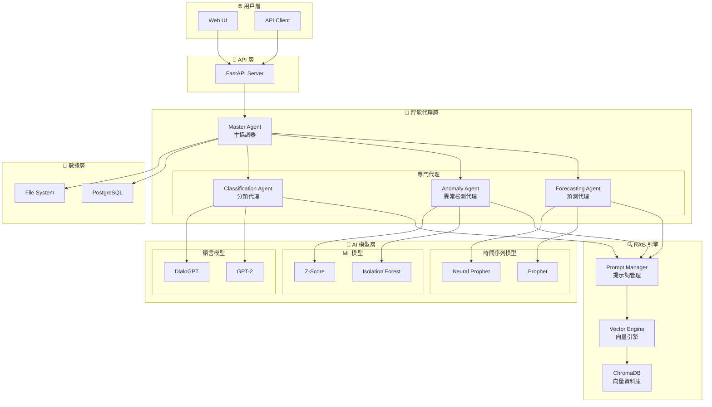
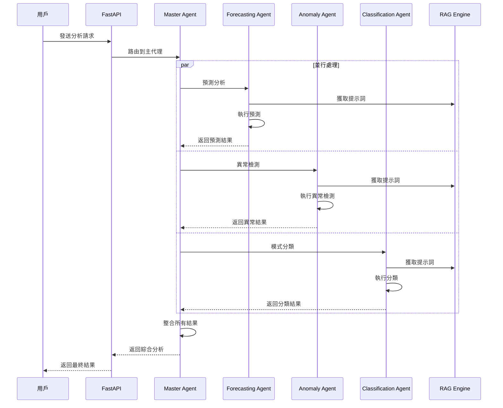

# 時間序列 RAG 框架 - 架構圖

## 🏗️ 系統架構

## 🔄 數據流程

## 🎯 核心組件

### 1. **主代理 (Master Agent)**
- 🎯 **功能**: 協調各個專門代理的工作
- 🔄 **職責**: 請求路由、結果聚合、負載均衡
- 📊 **特色**: 智能任務分配和結果整合

### 2. **預測代理 (Forecasting Agent)**
- 🔮 **功能**: 時間序列預測分析
- 🤖 **模型**: Prophet、Neural Prophet、Darts
- 📈 **輸出**: 預測值、置信區間、趨勢分析

### 3. **異常檢測代理 (Anomaly Detection Agent)**
- 🚨 **功能**: 異常點檢測和識別
- 🔍 **方法**: Z-Score、IQR、Isolation Forest、滾動統計
- 📊 **輸出**: 異常點列表、置信度、檢測方法

### 4. **分類代理 (Classification Agent)**
- 🏷️ **功能**: 時間序列模式分類
- 📋 **類型**: 趨勢分類、季節性分類、行為分類
- 🎯 **輸出**: 模式類型、置信度、特徵分析

### 5. **RAG 引擎 (RAG Engine)**
- 🔍 **功能**: 檢索增強生成
- 📚 **組件**: 提示詞管理、向量檢索、上下文生成
- 🎯 **目標**: 提升分析準確性和可解釋性

## 🛠️ 技術棧

### **後端技術**
- **框架**: FastAPI (Python)
- **異步**: AsyncIO
- **驗證**: Pydantic
- **日誌**: 自定義 Logger

### **AI/ML 技術**
- **語言模型**: GPT-2, DialoGPT, Breeze
- **時間序列**: Prophet, Neural Prophet, Darts
- **機器學習**: Scikit-learn, Isolation Forest
- **向量檢索**: ChromaDB, FAISS

### **資料庫技術**
- **關係資料庫**: PostgreSQL
- **向量資料庫**: ChromaDB
- **文件存儲**: 本地文件系統

### **部署技術**
- **容器化**: Docker
- **編排**: Kubernetes
- **CI/CD**: GitHub Actions
- **監控**: 自定義監控系統

## 📊 性能特點

### **高並發處理**
- 異步處理架構
- 並行代理執行
- 智能負載均衡

### **高準確性**
- 多模型集成
- RAG 技術增強
- 置信度評估

### **高可擴展性**
- 模組化設計
- 水平擴展支援
- 插件化架構

### **高可用性**
- 錯誤處理機制
- 自動重試機制
- 健康檢查系統

這個架構設計確保了系統的高性能、高可用性和高可擴展性，能夠滿足各種時間序列分析的需求。 