# 時間序列 RAG 框架 - 系統架構圖

## 🏗️ 整體架構概覽

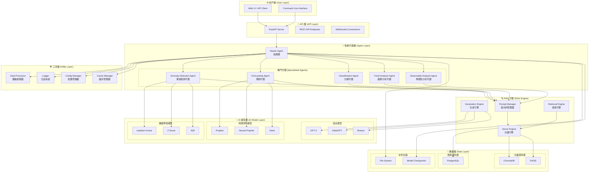

## 🔄 數據流程圖

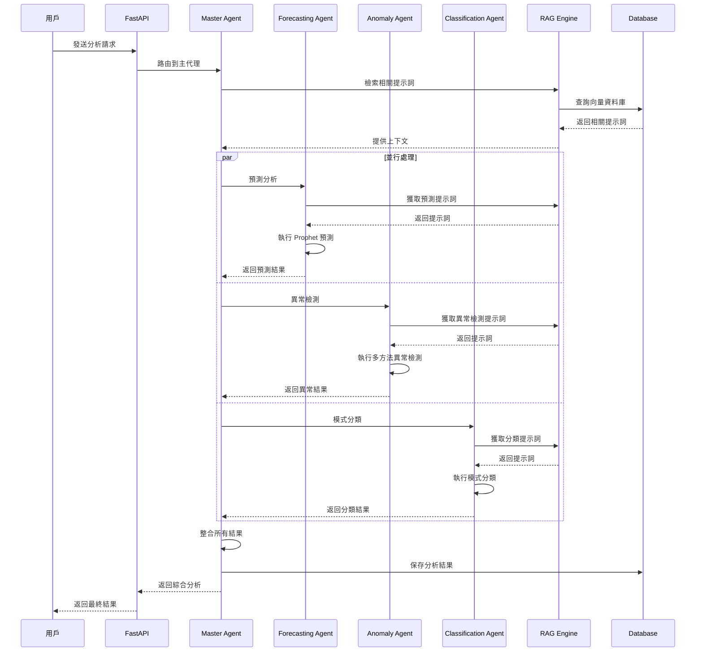

## 🏛️ 組件詳細架構

### 1. 主代理 (Master Agent)
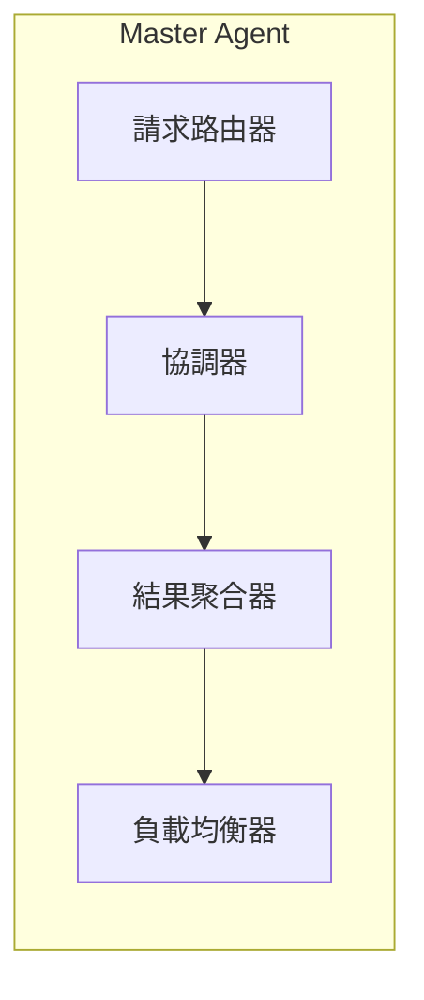

### 2. 預測代理 (Forecasting Agent)
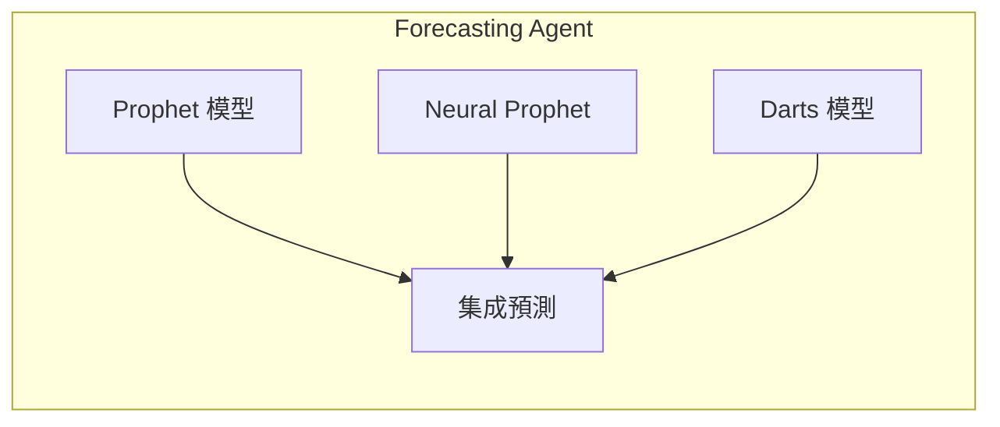

### 3. 異常檢測代理 (Anomaly Detection Agent)
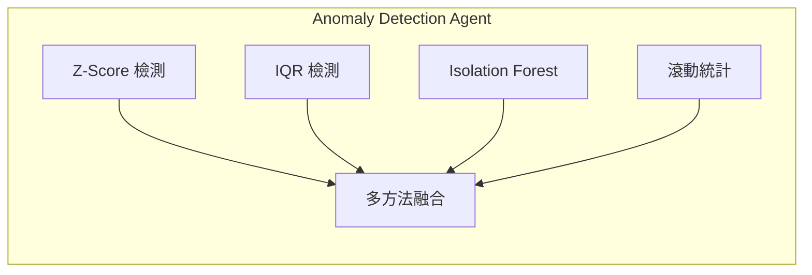

### 4. RAG 引擎架構
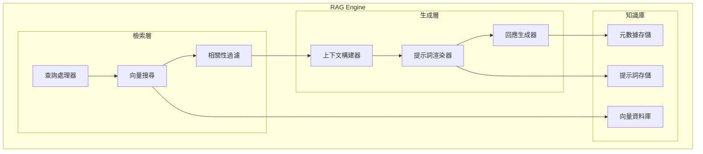

## 🎯 技術棧架構

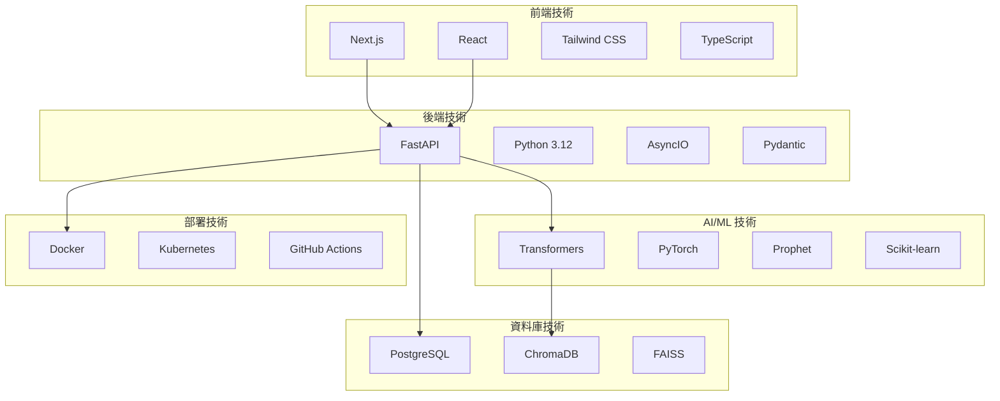

## 📊 性能指標架構

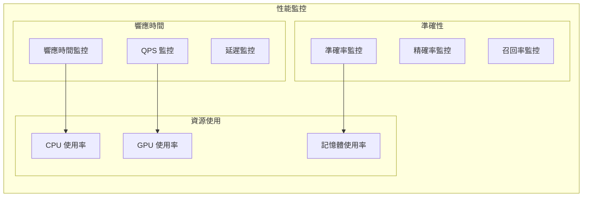

## 🔧 配置管理架構

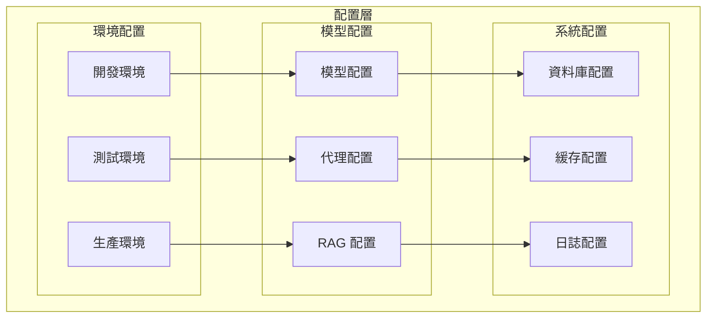

## 🚀 部署架構

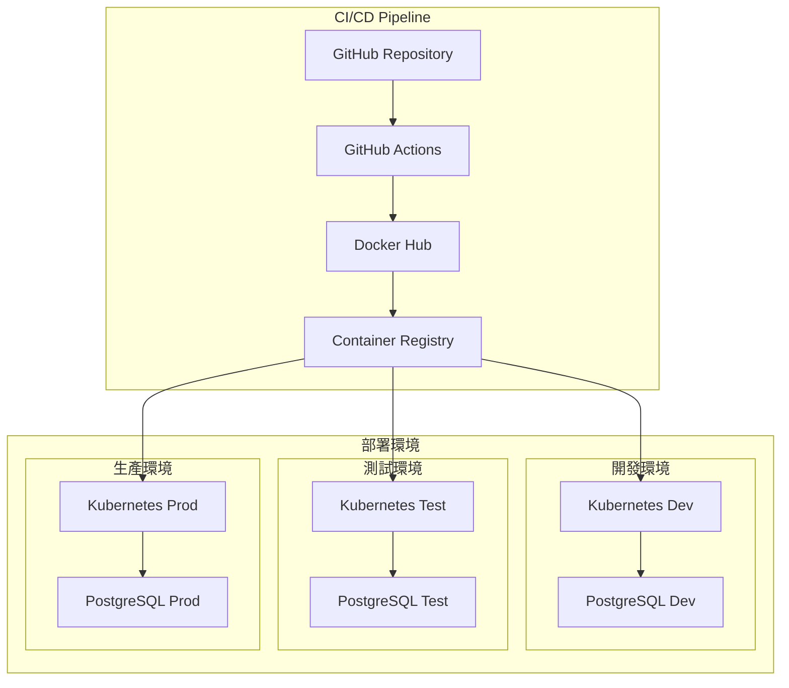

## 📈 擴展性架構

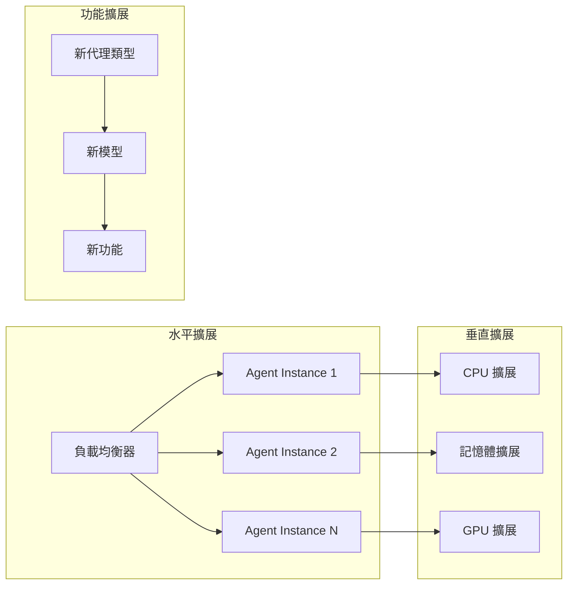

---

## 📋 架構特點總結

### 🎯 **核心優勢**
1. **模組化設計**: 各組件獨立，易於維護和擴展
2. **智能代理系統**: 專門化代理協同工作
3. **RAG 技術整合**: 提升分析準確性和可解釋性
4. **多模型支援**: 支援多種 AI 模型和時間序列模型
5. **高可擴展性**: 支援水平擴展和垂直擴展

### 🔧 **技術特色**
1. **異步處理**: 使用 AsyncIO 提升性能
2. **向量檢索**: 高效的相似性搜尋
3. **模型集成**: 多模型融合提高準確性
4. **自動化部署**: CI/CD 流水線
5. **監控體系**: 完整的性能監控

### 🚀 **部署靈活性**
1. **容器化部署**: Docker 容器化
2. **雲原生**: Kubernetes 編排
3. **多環境支援**: 開發、測試、生產環境
4. **自動化測試**: 完整的測試覆蓋
5. **版本控制**: Git 版本管理

這個架構設計確保了系統的高性能、高可用性和高可擴展性，能夠滿足各種時間序列分析的需求。 