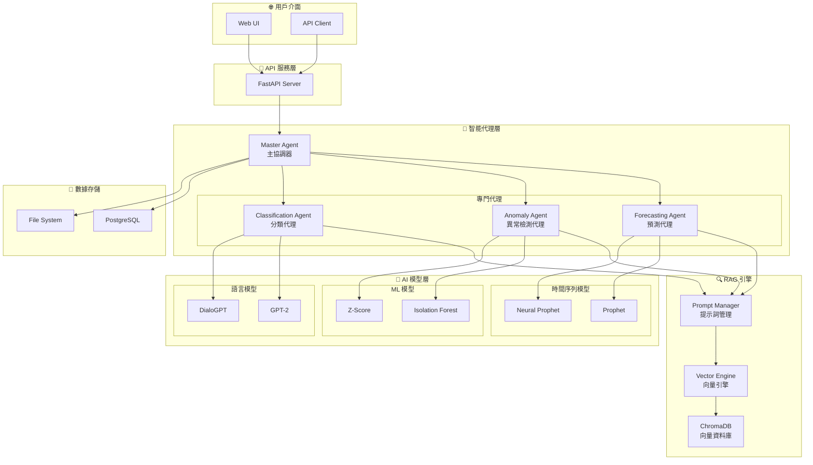
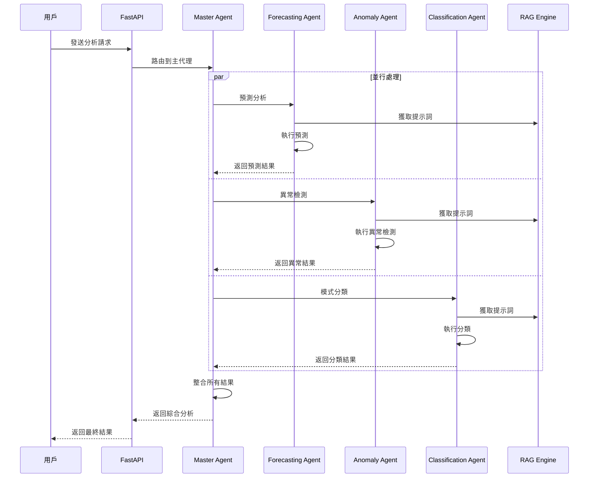
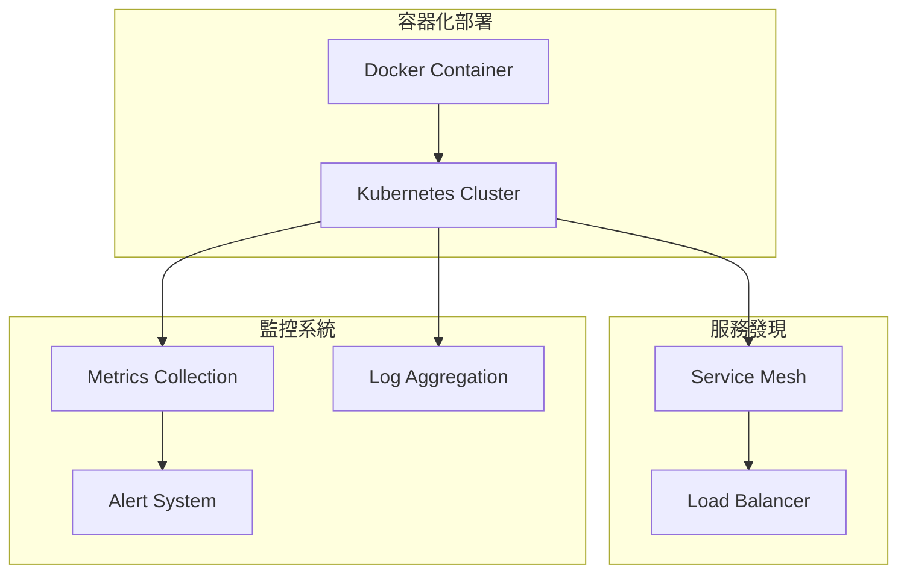

# 時間序列 RAG 框架 - 簡化架構圖

## 🏗️ 系統架構概覽

```mermaid
graph TB
    subgraph "🌐 用戶介面"
        UI[Web UI]
        API[API Client]
    end

    subgraph "🚀 API 服務層"
        FastAPI[FastAPI Server]
    end

    subgraph "🧠 智能代理層"
        MA[Master Agent<br/>主協調器]
        
        subgraph "專門代理"
            FA[Forecasting Agent<br/>預測代理]
            AA[Anomaly Agent<br/>異常檢測代理]
            CA[Classification Agent<br/>分類代理]
        end
    end

    subgraph "🔍 RAG 引擎"
        PM[Prompt Manager<br/>提示詞管理]
        VE[Vector Engine<br/>向量引擎]
        DB[ChromaDB<br/>向量資料庫]
    end

    subgraph "🤖 AI 模型層"
        subgraph "語言模型"
            GPT2[GPT-2]
            DialoGPT[DialoGPT]
        end
        
        subgraph "時間序列模型"
            Prophet[Prophet]
            NeuralProphet[Neural Prophet]
        end
        
        subgraph "ML 模型"
            IsolationForest[Isolation Forest]
            ZScore[Z-Score]
        end
    end

    subgraph "💾 數據存儲"
        PostgreSQL[PostgreSQL]
        FileSystem[File System]
    end

    %% 連接關係
    UI --> FastAPI
    API --> FastAPI
    FastAPI --> MA
    MA --> FA
    MA --> AA
    MA --> CA
    
    FA --> PM
    AA --> PM
    CA --> PM
    
    PM --> VE
    VE --> DB
    
    FA --> Prophet
    FA --> NeuralProphet
    AA --> IsolationForest
    AA --> ZScore
    CA --> GPT2
    CA --> DialoGPT
    
    MA --> PostgreSQL
    MA --> FileSystem
```

## 🔄 數據流程

```mermaid
sequenceDiagram
    participant U as 用戶
    participant API as FastAPI
    participant MA as Master Agent
    participant FA as Forecasting Agent
    participant AA as Anomaly Agent
    participant CA as Classification Agent
    participant RAG as RAG Engine

    U->>API: 發送分析請求
    API->>MA: 路由到主代理
    
    par 並行處理
        MA->>FA: 預測分析
        FA->>RAG: 獲取提示詞
        FA->>FA: 執行預測
        FA-->>MA: 返回預測結果
    and
        MA->>AA: 異常檢測
        AA->>RAG: 獲取提示詞
        AA->>AA: 執行異常檢測
        AA-->>MA: 返回異常結果
    and
        MA->>CA: 模式分類
        CA->>RAG: 獲取提示詞
        CA->>CA: 執行分類
        CA-->>MA: 返回分類結果
    end

    MA->>MA: 整合所有結果
    MA-->>API: 返回綜合分析
    API-->>U: 返回最終結果
```

## 🎯 核心組件

### 1. **主代理 (Master Agent)**
- 🎯 **功能**: 協調各個專門代理的工作
- 🔄 **職責**: 請求路由、結果聚合、負載均衡
- 📊 **特色**: 智能任務分配和結果整合

### 2. **預測代理 (Forecasting Agent)**
- 🔮 **功能**: 時間序列預測分析
- 🤖 **模型**: Prophet、Neural Prophet、Darts
- 📈 **輸出**: 預測值、置信區間、趨勢分析

### 3. **異常檢測代理 (Anomaly Detection Agent)**
- 🚨 **功能**: 異常點檢測和識別
- 🔍 **方法**: Z-Score、IQR、Isolation Forest、滾動統計
- 📊 **輸出**: 異常點列表、置信度、檢測方法

### 4. **分類代理 (Classification Agent)**
- 🏷️ **功能**: 時間序列模式分類
- 📋 **類型**: 趨勢分類、季節性分類、行為分類
- 🎯 **輸出**: 模式類型、置信度、特徵分析

### 5. **RAG 引擎 (RAG Engine)**
- 🔍 **功能**: 檢索增強生成
- 📚 **組件**: 提示詞管理、向量檢索、上下文生成
- 🎯 **目標**: 提升分析準確性和可解釋性

## 🛠️ 技術棧

### **後端技術**
- **框架**: FastAPI (Python)
- **異步**: AsyncIO
- **驗證**: Pydantic
- **日誌**: 自定義 Logger

### **AI/ML 技術**
- **語言模型**: GPT-2, DialoGPT, Breeze
- **時間序列**: Prophet, Neural Prophet, Darts
- **機器學習**: Scikit-learn, Isolation Forest
- **向量檢索**: ChromaDB, FAISS

### **資料庫技術**
- **關係資料庫**: PostgreSQL
- **向量資料庫**: ChromaDB
- **文件存儲**: 本地文件系統

### **部署技術**
- **容器化**: Docker
- **編排**: Kubernetes
- **CI/CD**: GitHub Actions
- **監控**: 自定義監控系統

## 📊 性能特點

### **高並發處理**
- 異步處理架構
- 並行代理執行
- 智能負載均衡

### **高準確性**
- 多模型集成
- RAG 技術增強
- 置信度評估

### **高可擴展性**
- 模組化設計
- 水平擴展支援
- 插件化架構

### **高可用性**
- 錯誤處理機制
- 自動重試機制
- 健康檢查系統

## 🚀 部署架構

```mermaid
graph TB
    subgraph "容器化部署"
        Docker[Docker Container]
        K8s[Kubernetes Cluster]
    end
    
    subgraph "服務發現"
        Service[Service Mesh]
        LoadBalancer[Load Balancer]
    end
    
    subgraph "監控系統"
        Metrics[Metrics Collection]
        Logs[Log Aggregation]
        Alerts[Alert System]
    end
    
    Docker --> K8s
    K8s --> Service
    Service --> LoadBalancer
    K8s --> Metrics
    K8s --> Logs
    Metrics --> Alerts
```

這個架構設計確保了系統的高性能、高可用性和高可擴展性，能夠滿足各種時間序列分析的需求。 